My hackerrank Profile : https://www.hackerrank.com/profile/mananpujara05
<br>My Submissions : https://www.hackerrank.com/submissions/all

# Task 1 
> Query the list of CITY names from STATION which have vowels (i.e., a, e, i, o, and u) as both their first and last characters. Your result cannot contain duplicates.

#### Table structure

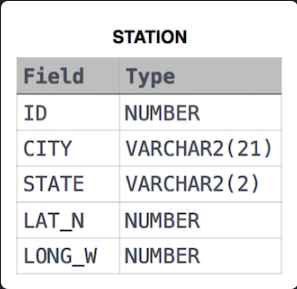

```sql
SELECT CITY FROM STATION 
WHERE LOWER(SUBSTR(CITY, 1, 1)) IN ('a', 'e', 'i', 'o', 'u') 
    AND LOWER(SUBSTR(CITY, -1, 1)) IN ('a', 'e', 'i', 'o', 'u');
```
#### Result


# Task 2 
> Query the difference between the maximum and minimum populations in CITY.

#### Table structure


```sql
SELECT max(POPULATION) - min(POPULATION) AS DIFFERENCE FROM CITY;
```

#### Result

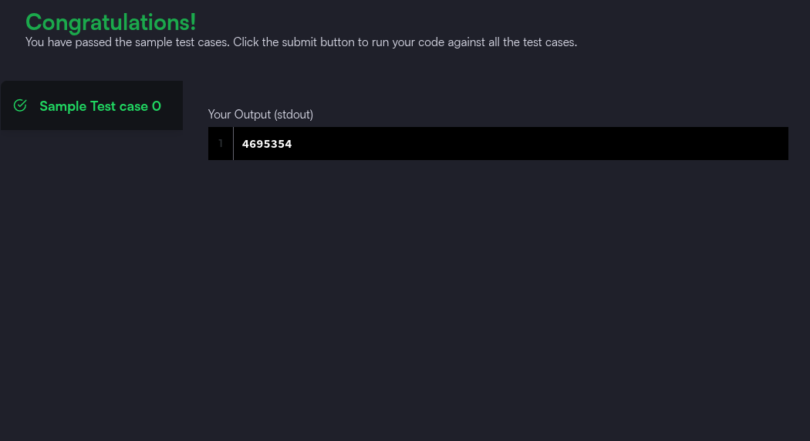


# Task 3 
> Query the difference between the maximum and minimum populations in CITY.

#### Table structure


```sql
SELECT ROUND(
    SQRT(
        POW(MAX(LAT_N) - MIN(LAT_N), 2) +
        POW(MAX(LONG_W) - MIN(LONG_W), 2) ), 4 ) 
AS distance
FROM STATION;
```

#### Result

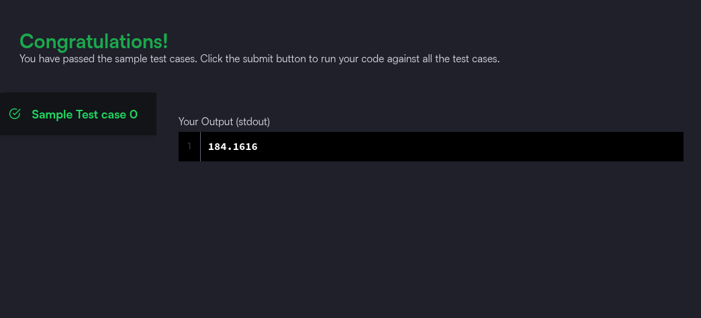

# Task 4 
> A median is defined as a number separating the higher half of a data set from the lower half. Query the median of the Northern Latitudes (LAT_N) from STATION and round your answer to  decimal places.

#### Table structure


```sql
SELECT Round(sts.lat_n, 4)
FROM station AS sts
WHERE (SELECT Count(lat_n) FROM station WHERE lat_n < sts.lat_n) = (SELECT Count(lat_n) FROM station WHERE lat_n > sts.lat_n);
```

#### Result

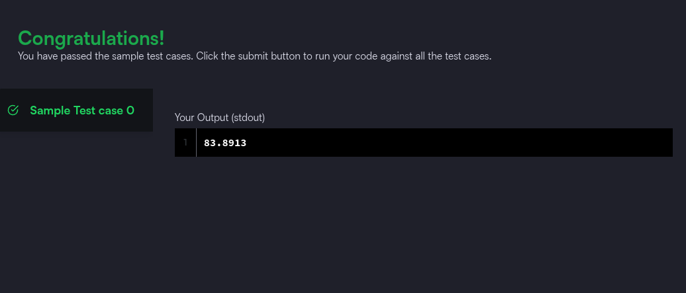

# Task 5
> Given the CITY and COUNTRY tables, query the names of all cities where the CONTINENT is 'Africa'.
Note: CITY.CountryCode and COUNTRY.Code are matching key columns.

#### Table structure

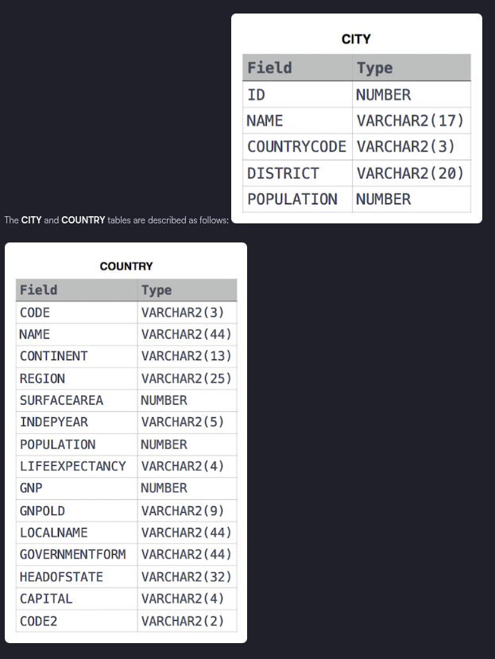
```sql
SELECT CITY.Name
FROM CITY
JOIN COUNTRY
  ON CITY.CountryCode = COUNTRY.Code
WHERE COUNTRY.Continent = 'Africa';
```

#### Result

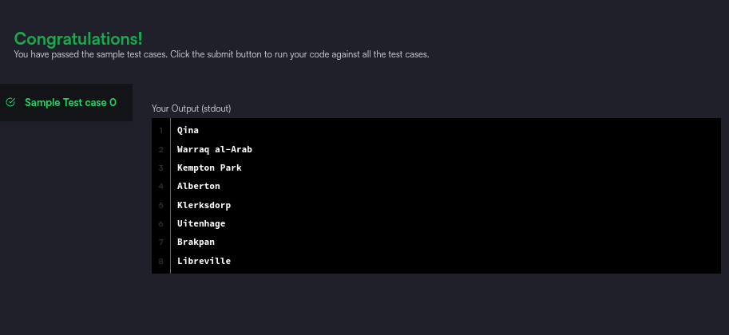

# Task 6 
> Given the CITY and COUNTRY tables, query the names of all cities where the CONTINENT is 'Africa'.
Note: CITY.CountryCode and COUNTRY.Code are matching key columns.

#### Table structure


```sql
SELECT CITY.Name
FROM CITY
INNER JOIN COUNTRY
  ON CITY.CountryCode = COUNTRY.Code
WHERE COUNTRY.Continent = 'Africa';
```

#### Result

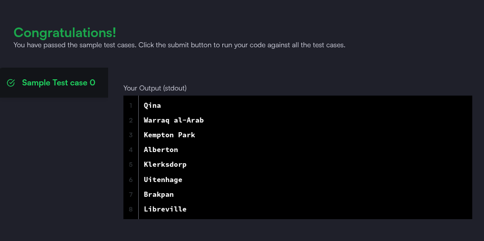

# Task 7
> The Report : Show 3 columns Name, Grade, Marks

#### Table structure


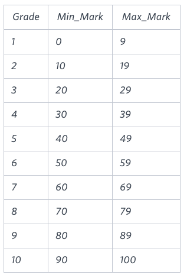
```sql
SELECT 
  CASE 
    WHEN g.Grade >= 8 THEN s.Name
    ELSE 'NULL'
  END AS Name,
  g.Grade,
  s.Marks
FROM Students s
JOIN Grades g
  ON s.Marks BETWEEN g.Min_Mark AND g.Max_Mark
ORDER BY 
  g.Grade DESC,
  CASE 
    WHEN g.Grade >= 8 THEN s.Name
    ELSE NULL
  END ASC,
  CASE 
    WHEN g.Grade < 8 THEN s.Marks
    ELSE NULL
  END ASC;
```

#### Result

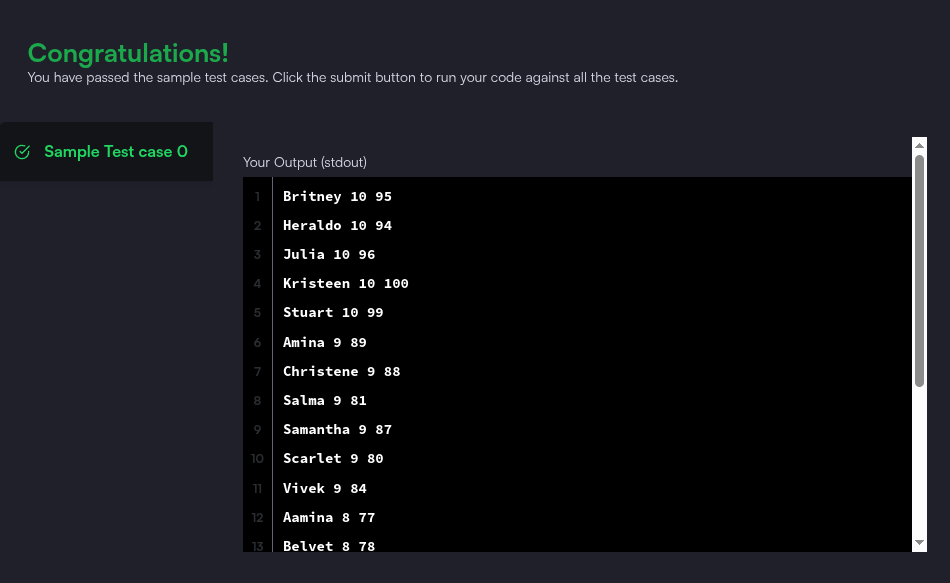

# Task 8 
> The Competitors Question

```sql
SELECT H.hacker_id, H.name
FROM Submissions S
JOIN Challenges C ON S.challenge_id = C.challenge_id
JOIN Difficulty D ON C.difficulty_level = D.difficulty_level
JOIN Hackers H ON S.hacker_id = H.hacker_id
WHERE S.score = D.score
GROUP BY H.hacker_id, H.name
HAVING COUNT(*) > 1
ORDER BY COUNT(*) DESC, H.hacker_id;

```

#### Result

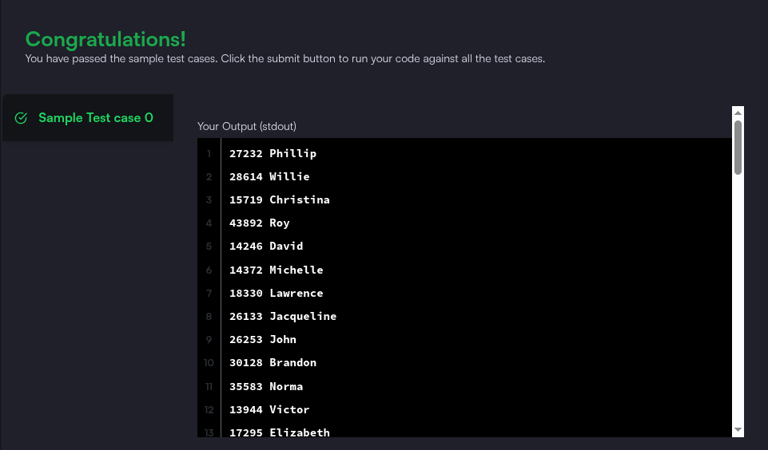


# Task 9
> The Ollivander's Inventory Question

```sql
SELECT w.id, wp.age, w.coins_needed, w.power
FROM wands w
JOIN wands_property wp ON w.code = wp.code
WHERE wp.is_evil = 0
  AND w.coins_needed = (
    SELECT MIN(w2.coins_needed)
    FROM wands w2
    JOIN wands_property wp2 ON w2.code = wp2.code
    WHERE w2.power = w.power AND wp2.age = wp.age AND wp2.is_evil = 0
  )
ORDER BY w.power DESC, wp.age DESC;


```

#### Result

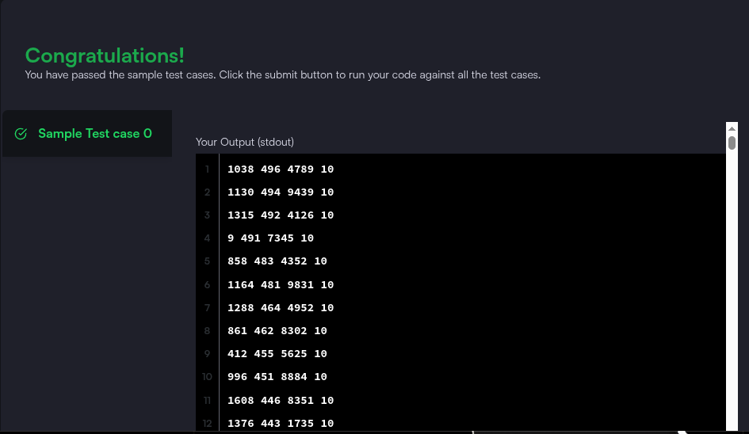


# Task 10
> The Contest Leaderboard Question

```sql
SELECT h.hacker_id, h.name, SUM(max_scores.max_score) AS total_score
FROM Hackers h
JOIN (
    SELECT s.hacker_id, s.challenge_id, MAX(s.score) AS max_score
    FROM Submissions s
    GROUP BY s.hacker_id, s.challenge_id
) AS max_scores
  ON h.hacker_id = max_scores.hacker_id
WHERE max_scores.max_score > 0
GROUP BY h.hacker_id, h.name
ORDER BY total_score DESC, h.hacker_id;
```

#### Result

