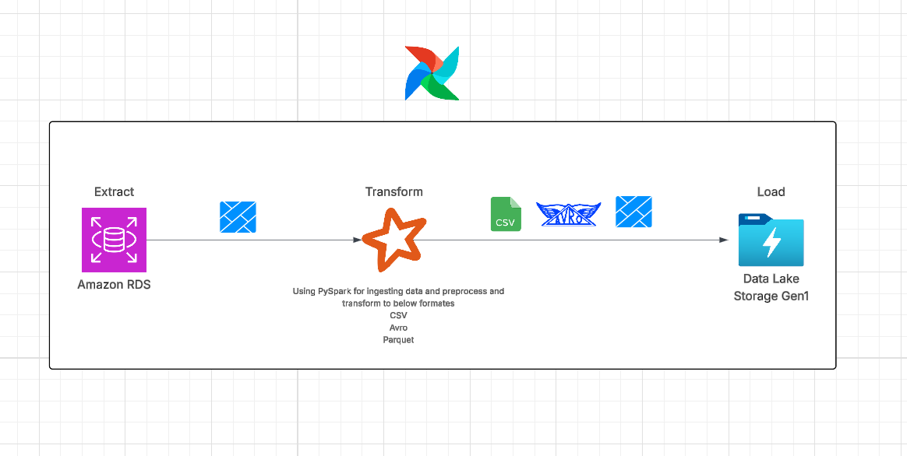
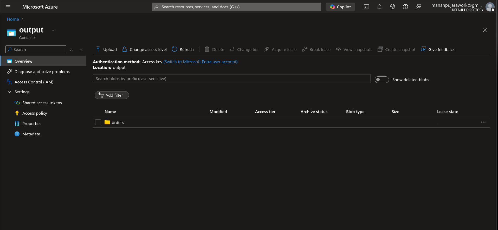
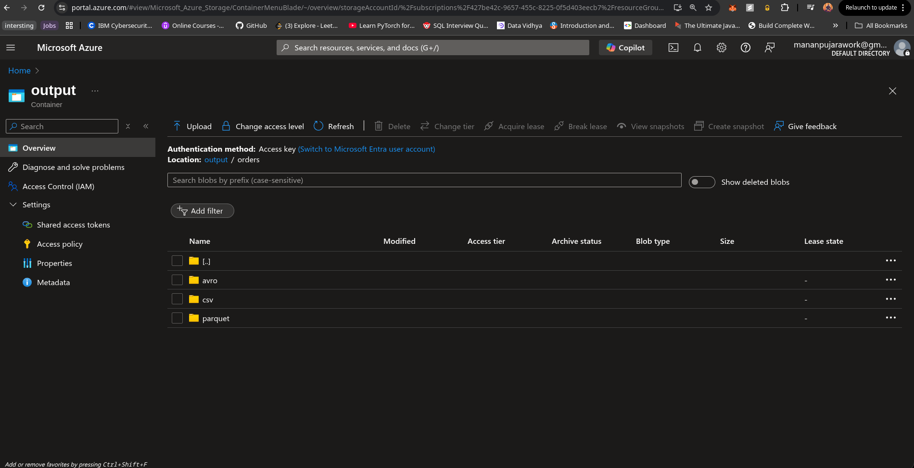
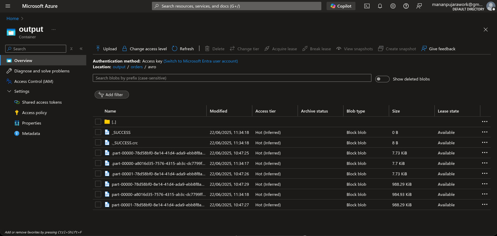
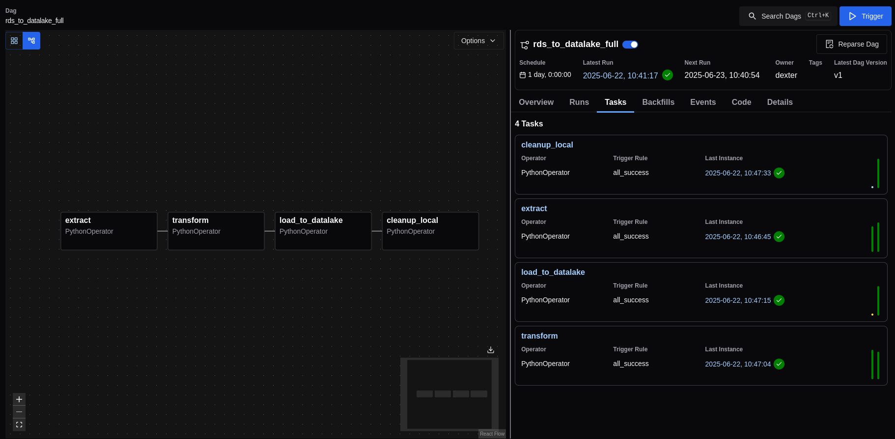
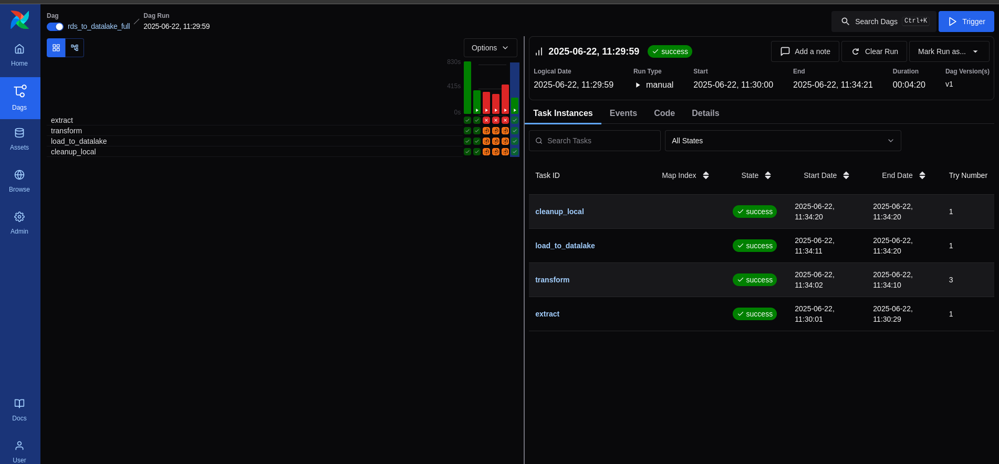
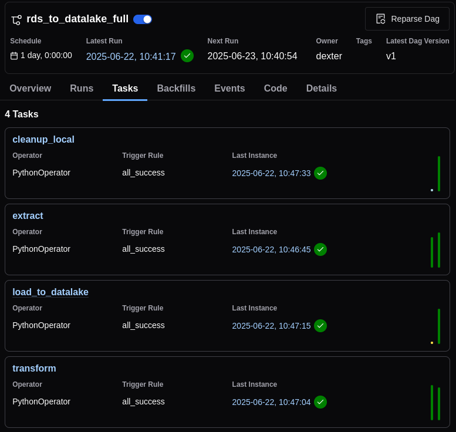

<h1 align="center">Week 5 Assignment: Data Integration & Pipeline Automation</h1>


> **Thanks to [CSI (Celebal Summer Internship)](https://www.celebaltech.com/)** this task gave me immense knowledge and hands-on experience with real-world ETL pipelines, cloud services, and automation tools.  
>
> I truly appreciate the opportunity to learn and build!

<p align="center">
  
</p>


## 🚀 Overview

This task focuses on **data integration** and **pipeline automation** using PySpark and Airflow.  
We copy data from an AWS RDS (PostgreSQL) database into multiple file formats **CSV**, **Parquet**, and **Avro** for storage or further processing.  

The pipeline is automated using Airflow’s scheduled triggers (daily) to ensure timely and efficient execution.  
Additionally, the solution includes:
- **Full table migrations**
- **Selective table/column transfers** for business-specific needs

⚡ The end result?  
Each selected table is stored in Azure Blob Storage with subfolders for each format.

---

## 🛠️ Technologies Used
- **AWS RDS (PostgreSQL)** — Source database
- **Azure Blob Storage** — Data lake destination
- **PySpark** — Data extraction, transformation, and format conversion
- **Apache Airflow** — Workflow orchestration

---

## 📌 Prerequisites
Before running this project, ensure you have:
- An **AWS account** with RDS (PostgreSQL) set up (Free Tier works)
- An **Azure account** with:
  - Resource Group
  - Storage Account
- **Airflow** installed locally
- **PySpark** installed
- A valid `.env` file with your credentials

---

## 💡 Project Steps

1️⃣ **Check Test Notebook**  
👉 Explore [`Test.ipynb`](./Test.ipynb) — verify AWS/Azure connections and load synthetic data into RDS.

2️⃣ **Set up environment variables**  
👉 Create a `.env` file containing your AWS RDS and Azure Blob Storage credentials.

3️⃣ **Set up virtual environment**  
```bash
python -m venv venv
source venv/bin/activate  # Linux/Mac
venv\Scripts\activate     # Windows
````

4️⃣ **Install dependencies**

```bash
pip install -r requirements.txt
```

5️⃣ **Install Airflow (if not already)**

```bash
pip install apache-airflow
```

6️⃣ **Start Airflow**

```bash
airflow standalone
```

Access the Airflow UI at [http://localhost:8080](http://localhost:8080).
⚠️ Check logs or your Airflow directory for the auto-generated username and password.

7️⃣ **Deploy your DAG**
Copy [`rds_to_datalake.py`](./rds_to_datalake.py) into your `airflow/dags/` folder.
Your DAG will appear in the Airflow UI.

8️⃣ **Trigger and monitor your DAG**
👉 Run your DAG and observe data flowing to Azure Blob Storage 🚀

---

## 📝 Notes

✅ **Transformation logic**

* Example: We filter rows with `quantity > 5`
* Customize `selected_tables` and filtering as per your business logic

✅ **Storage structure**
Each table creates a folder in Azure Blob Storage containing:

```
/<tablename>/
    ├── csv/
    ├── parquet/
    └── avro/
```

---

## 📂 Files in this repo

| File                 | Purpose                               |
| -------------------- | ------------------------------------- |
| `Test.ipynb`         | Test connections and data loading     |
| `rds_to_datalake.py` | The Airflow DAG                       |
| `requirements.txt`   | Python dependencies                   |
| `.env`               | Credentials (do not upload to GitHub) |
| `images/image.png`   | Pipeline diagram                      |

---

## 🎉 Final Outcome

✅ Automated daily ETL pipeline
✅ Data stored in multiple formats
✅ Ready for analytics or further processing

### 💾 Azure Blob Storage Structure  
<p align="center">
  <br>
  <em>Azure Blob Storage: Table folder structure</em>
</p>

<p align="center">
  <br>
  <em>Azure Blob Storage: CSV/Parquet/Avro files</em>
</p>

<p align="center">
  <br>
  <em>Azure Blob Storage: Uploaded data files</em>
</p>

---

### ⏰ Airflow DAG Execution  

<p align="center">
  <br>
  <em>Airflow: DAG list with your ETL pipeline</em>
</p>

<p align="center">
  <br>
  <em>Airflow: DAG graph view</em>
</p>

<p align="center">
  <br>
  <em>Airflow: Task execution details</em>
</p>

---

<p align="center">💡 *Feel free to extend this pipeline to include more transformations, monitoring, or streaming data!*</p>
